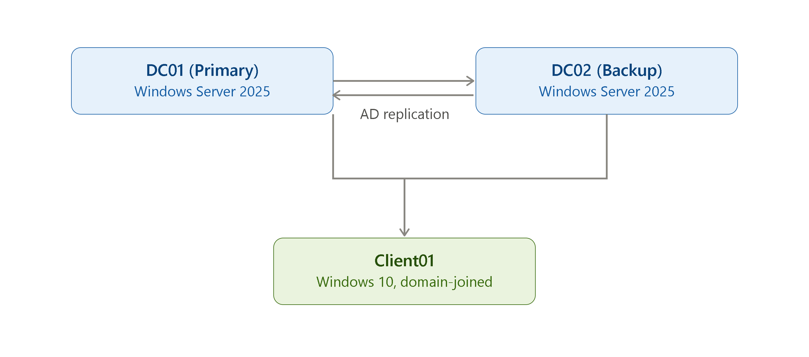

# 🛡️ Project Vanguard AD: Building a High-Availability Enterprise Infrastructure


---

## 📌 Project Overview

I built this lab to practice the kinds of tasks I'd actually be doing on a helpdesk: managing user accounts, troubleshooting login issues, dealing with mapped drives, fixing permissions problems on shared folders, and using the basic tools (ADUC, Group Policy, Command Prompt) that show up in most Windows IT environments.

It's a Windows Server 2025 machine running as a primary domain controller, with a second Windows Server 2025 machine set up as an additional domain controller for backup, and a Windows 10 client joined to the domain — all running in VMware on my laptop. Having two domain controllers meant I also got to check that things kept working properly even if one of them went down, which is something that matters a lot in real IT environments.

---

## 🚀 Lab Environment



---

## 🏢 Lab Infrastructure & Architecture

| Component                          | Details                                                             |
|-------------------------------------|----------------------------------------------------------------------|
| Virtualization Platform             | VMware Workstation                                                  |
| Network Mode                        | Custom Virtual Network (VMnet0) — isolated lab network              |
| Primary Domain Controller (PDC)     | Windows Server — 4GB RAM, 4 vCPU (Hostname: `DC-01`)                 |
| Additional Domain Controller (ADC)  | Windows Server — 4GB RAM, 4 vCPU (Hostname: `DC-02`)                 |
| Client Machine                      | Windows 10 — 4GB RAM, 4 vCPU (Hostname: `CLIENT-01`)                 |
| Domain Name                         | `itsupport.tech`                                                    |

---

## 🎯 What This Lab Demonstrates

Skills practiced at a helpdesk / Tier 1 support level:

- Setting up a Windows domain and joining a client machine to it
- Creating, organizing, and managing user accounts in Active Directory
- Working with security groups and Organizational Units (OUs)
- Configuring basic Group Policy settings — login banner, password requirements, mapped drives
- Setting up NTFS permissions so each department can only access its own files
- Troubleshooting a real-world ticket where a user's mapped drive went missing
- Using the day-to-day tools of a Tier 1 tech: ADUC, GPMC, and Command Prompt (`gpresult`, `gpupdate`, `net use`, `whoami`)

---

## 🖥️ Setting Up The Domain

I started by installing Windows Server 2025 and promoting it to a domain controller, which created the domain and gave me a place to manage user accounts, DNS, and shared folders — the exact kind of environment I'd be supporting on a helpdesk.

To make the setup closer to a real IT environment, I added a second Windows Server 2025 machine as an additional domain controller for backup. This meant I could actually test what happens when one DC goes down — checking that logins, file access, and DNS resolution kept working through the second server — which is a scenario that matters a lot in production environments.

Finally, I joined a Windows 10 client to the domain. The whole setup runs in VMware on my laptop, which let me simulate a small enterprise network end-to-end: managing users, troubleshooting login issues, fixing mapped drives, and resolving permissions problems on shared folders, using the same tools (ADUC, Group Policy, Command Prompt) I'd rely on day to day.

---

## 📂 Organizing The Directory

Active Directory uses Organizational Units (OUs) as folders for organizing users, computers, and groups.

I set up a structure with a top-level **USA** OU containing sub-folders for different types of objects:

```
USA
├── Departments
│   ├── HR
│   ├── IT
│   ├── Finance
│   └── Sales
├── Computers
├── Groups
└── Service Accounts
```

---
